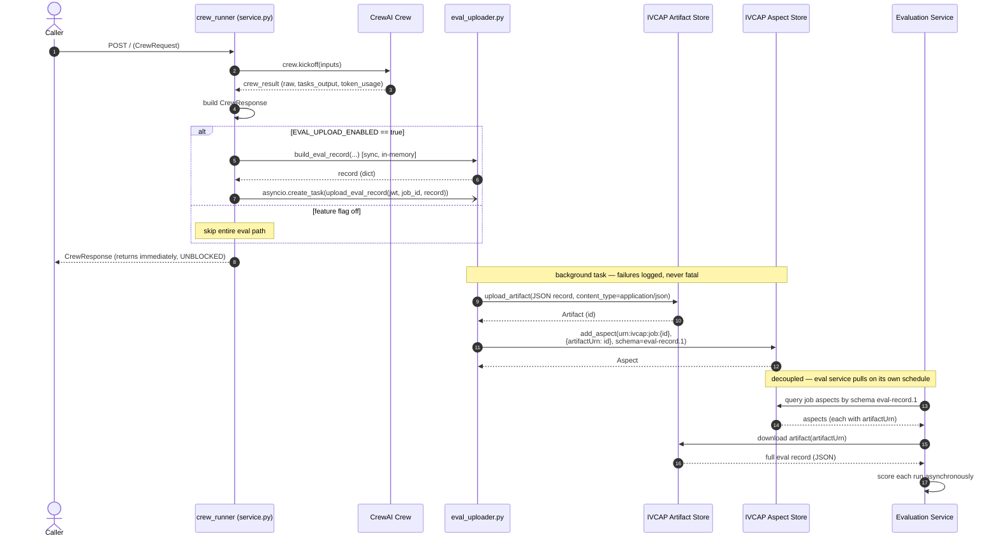

# Design: Auto-Upload Crew Results to the Evaluation Service

Status: **Implemented** (`eval_uploader.py`, wired into `service.py` STEP 10).
Branch: `feature/upload_eval_reports`

## 1. Goal

After a crew run, automatically publish a self-contained **evaluation record** so a
separate evaluation service can score the run without re-running the crew. The record
bundles:

- The **inputs** the caller provided (the research topic / query, additional inputs)
- The **final crew answer** and **per-task outputs**
- **Provenance**: service id, job id, crew reference
- **Cost/perf metrics**: token usage (prompt/completion/cached/total), wall-clock & CPU time
- **LLM configuration**: model, planning model, temperature

## 2. Design decisions (locked)

| Decision | Choice | Rationale |
|---|---|---|
| Delivery mechanism | **Upload the record as a JSON artifact, then attach an aspect to the job that references it** (`{"artifactUrn": ...}`) | Platform idiom (content → artifact, reference → aspect). Keeps aspects small; no size limit on the record body. |
| Timing | **Async / non-blocking** (`asyncio.create_task`) | Eval upload must never delay or fail the `CrewResponse`. Failures are logged, never fatal. |
| Trigger | **Feature flag** `EVAL_UPLOAD_ENABLED`, **default OFF** | Opt-in rollout; checked inline in `crew_runner` (`os.getenv("EVAL_UPLOAD_ENABLED", "False").lower() == "true"`). |
| Entity URN | **Job URN** `urn:ivcap:job:{job_id}` (constructed; `jobCtxt.job_id` is the bare `1234...` id) | Each run's aspect is traceable to its job. |
| Auth | **Dedicated authenticated client** `IVCAP(url, token=jwt)` | Artifact upload + aspect write are authorized writes; `jobCtxt.ivcap` is unauthenticated in-platform. Passing `url`+`token` forces the `AuthenticatedClient` branch. |
| Discovery | Eval service **queries job aspects by schema** `urn:sd-core:schema.crewai.eval-record.1`, reads `artifactUrn`, downloads the artifact | Pull model; no push/uptime dependency on the eval service. |
| Access policy | **Default (private)** — no explicit policy passed | Records are private until the eval service reads them under its own access. |

## 3. Architecture & data flow

```
crew_runner()                                    (service.py, STEP 10)
  │
  ├─ crew.kickoff(inputs)  ──► crew_result  (raw, tasks_output, token_usage)
  ├─ build CrewResponse  ───────────────────────────────► return to caller (UNBLOCKED)
  │
  └─ if EVAL_UPLOAD_ENABLED:
        record = build_eval_record(...)        # sync, in-memory (pre-cleanup)
        asyncio.create_task(                    ┌─ eval_uploader.py ───────────────────────┐
            upload_eval_record(jwt, job_id,     │ ivcap = IVCAP(url, token=jwt)             │
                               record))  ─────► │ artifact = ivcap.upload_artifact(         │
        # fire-and-forget, logged               │     name="eval-record-{job}.json",        │
                                                │     io_stream=<record as JSON>,           │
                                                │     content_type="application/json")      │
                                                │ ivcap.add_aspect(                          │
                                                │     urn:ivcap:job:{job_id},                │
                                                │     {"artifactUrn": artifact.id},          │
                                                │     schema=EVAL_RECORD_SCHEMA)             │
                                                └────────────────────────────────────────────┘
                                                                  │
                                                                  ▼
                              Eval service: query job aspects by EVAL_RECORD_SCHEMA
                              → read artifactUrn → download artifact → score the record
```

### 3.1 Sequence (non-blocking upload + async ingestion)

`EVAL_UPLOAD_ENABLED` is the **feature flag for the whole feature**: `crew_runner` checks
it before building the record or spawning the upload task. When unset/`false`, none of the
eval path runs.



## 4. Schemas

### 4.1 Job aspect (the reference)

Schema URN: **`urn:sd-core:schema.crewai.eval-record.1`**, attached to `urn:ivcap:job:{job_id}`:

```json
{ "$schema": "urn:sd-core:schema.crewai.eval-record.1", "artifactUrn": "urn:ivcap:artifact:..." }
```

`artifactUrn` is the same key `download_manager` already resolves, so the artifact can be
fetched with the existing download path.

### 4.2 Artifact body (the full record)

The artifact (`application/json`) holds the record produced by `build_eval_record`:

```json
{
  "$schema": "urn:sd-core:schema.crewai.eval-record.1",
  "service_id": "urn:ivcap:service:...",          // os.environ["IVCAP_SERVICE_ID"]
  "job_id": "urn:ivcap:job:9f3c...",
  "crew_ref": "urn:ivcap:aspect:..." | null,       // req.crew_ref (null for inline crews)
  "inputs": {
    "query": "Novel uses for mRNA delivery in oncology",   // req.inputs["research_topic"]
    "additional_inputs": "..."                              // req.inputs["additional_inputs"]
  },
  "result": {
    "answer": "## Summary\n...",                    // crew_result.raw
    "task_outputs": [                               // crew_result.tasks_output[*]
      { "order": 1, "name": "research", "agent": "Researcher", "description": "...", "summary": "...", "raw": "..." }
    ]
  },
  "metrics": {                                      // crew_result.token_usage + timings
    "total_tokens": 48213, "prompt_tokens": 39120, "completion_tokens": 9093,
    "cached_prompt_tokens": 12000, "successful_requests": 11,
    "run_time_sec": 84.21, "process_time_sec": 3.04
  },
  "llm": {                                          // from the live LLM instances
    "model": "gpt-4.1", "planning_model": "gpt-4.1", "temperature": 0.7
  }
}
```

## 5. Field source map (`build_eval_record`)

| Record field | Source |
|---|---|
| `service_id` | `os.environ["IVCAP_SERVICE_ID"]` (always present in the deployment env) |
| `job_id` | `job_entity_urn(jobCtxt.job_id)` → `urn:ivcap:job:{id}` |
| `crew_ref` | `req.crew_ref` |
| `inputs.query` | `req.inputs["research_topic"]` |
| `inputs.additional_inputs` | `req.inputs["additional_inputs"]` |
| `result.answer` | `crew_result.raw` |
| `result.task_outputs[]` | `crew_result.tasks_output[i]` → `order/name/agent/description/summary/raw` |
| `metrics.*tokens* / successful_requests` | `crew_result.token_usage` (`UsageMetrics`) |
| `metrics.run_time_sec` / `process_time_sec` | `response.run_time_sec` / `response.process_time_sec` |
| `llm.model` / `temperature` | the live main `llm` instance |
| `llm.planning_model` | the live `planning_llm` instance |

## 6. Implementation

### 6.1 `eval_uploader.py`

- `EVAL_RECORD_SCHEMA` — schema URN constant.
- `job_entity_urn(job_id)` — bare id → `urn:ivcap:job:{id}` (idempotent).
- `build_eval_record(*, req, crew_result, llm, planning_llm, run_time_sec, process_time_sec, job_id) -> dict`
  — pure, no I/O; helpers `_token_usage`, `_task_outputs`, `_inputs_block`, `_llm_block`.
- `_authenticated_ivcap(jwt_token) -> IVCAP` — `IVCAP(url=IVCAP_URL|IVCAP_BASE_URL, token=jwt)`.
- `_publish_eval_record(ivcap, job_id, record) -> str` — `upload_artifact` then `add_aspect({"artifactUrn": ...})`.
- `upload_eval_record(jwt_token, job_id, record, *, ivcap=None)` — fire-and-forget; runs
  `_publish_eval_record` in a worker thread (`asyncio.to_thread`); skips if no JWT; swallows all exceptions.

### 6.2 Integration in `service.py::crew_runner` (STEP 10)

```python
if os.getenv("EVAL_UPLOAD_ENABLED", "False").lower() == "true":
    try:
        eval_record = build_eval_record(
            req=req, crew_result=crew_result, llm=llm, planning_llm=planning_llm,
            run_time_sec=response.run_time_sec, process_time_sec=response.process_time_sec,
            job_id=jobCtxt.job_id,
        )
        asyncio.create_task(upload_eval_record(jwt_token, jobCtxt.job_id, eval_record))
    except Exception:
        logger.exception("Failed to queue eval record (non-fatal)")
return response
```

The record is built **synchronously** (cheap, in-memory) so it captures `crew_result`
before the `finally` block deletes `runs/{job_id}`; only the network I/O (artifact upload
+ aspect write) runs in the background task.

### 6.3 Config / env vars

```bash
EVAL_UPLOAD_ENABLED=true                  # feature flag; default OFF (anything but "true" disables)
IVCAP_SERVICE_ID=urn:ivcap:service:...    # this service's URN, recorded in the record
# IVCAP_BASE_URL / IVCAP_URL              # already set; used to build the authenticated client
# Access policy: default (private) — nothing passed to upload_artifact / add_aspect.
```

### 6.4 Tests (`tests/test_eval_uploader.py`, 13 tests, all passing)

- `job_entity_urn`: bare→URN, idempotent.
- `build_eval_record`: top-level shape (+ dropped fields absent), inputs block, result block,
  metrics block, llm block, zeroed-on-missing-usage, JSON round-trip.
- `upload_eval_record`: uploads artifact then links aspect (`{"artifactUrn": ...}`, no policy);
  swallows exceptions (and skips `add_aspect` on upload failure); skips without JWT; builds the
  authenticated client from the JWT.

## 7. Known follow-ups

- **`build_eval_record` reads fixed input keys** (`research_topic`, `additional_inputs`). If a
  crew uses a different primary-input key, `inputs.query` will be `None`; revisit if crews vary.
